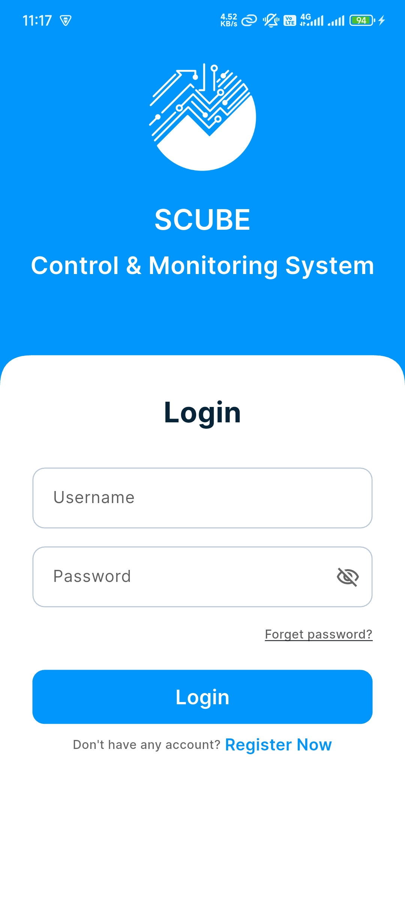
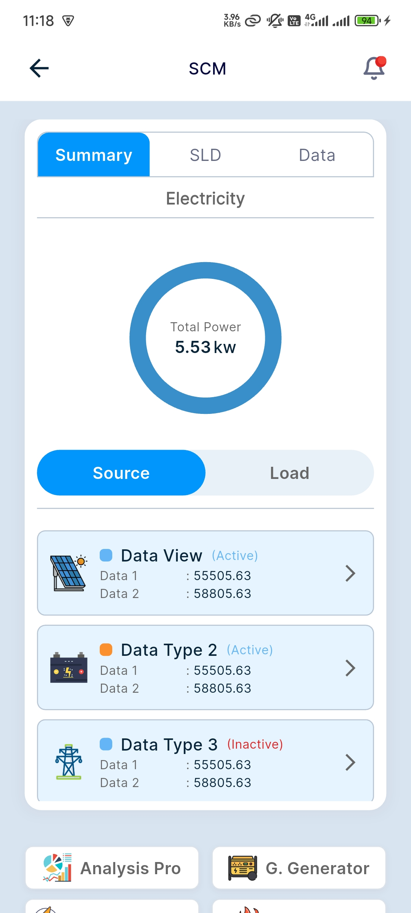
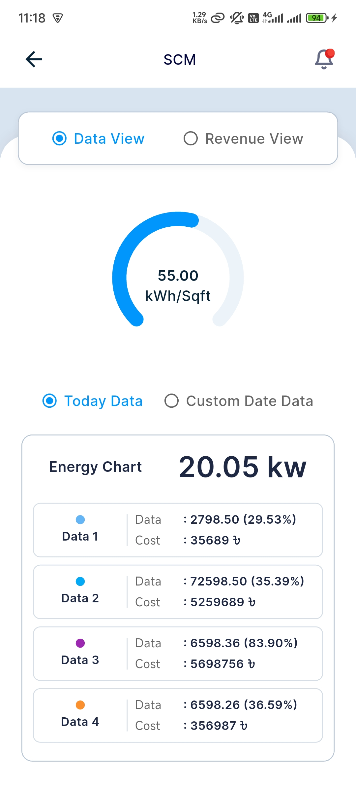
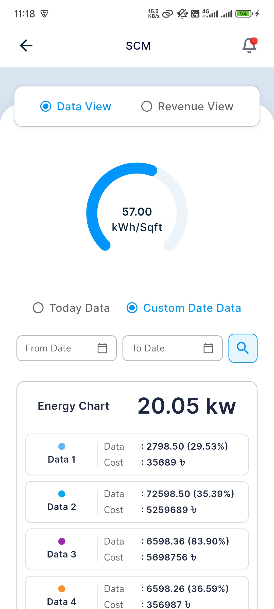
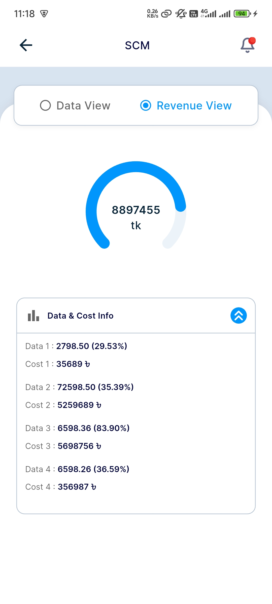
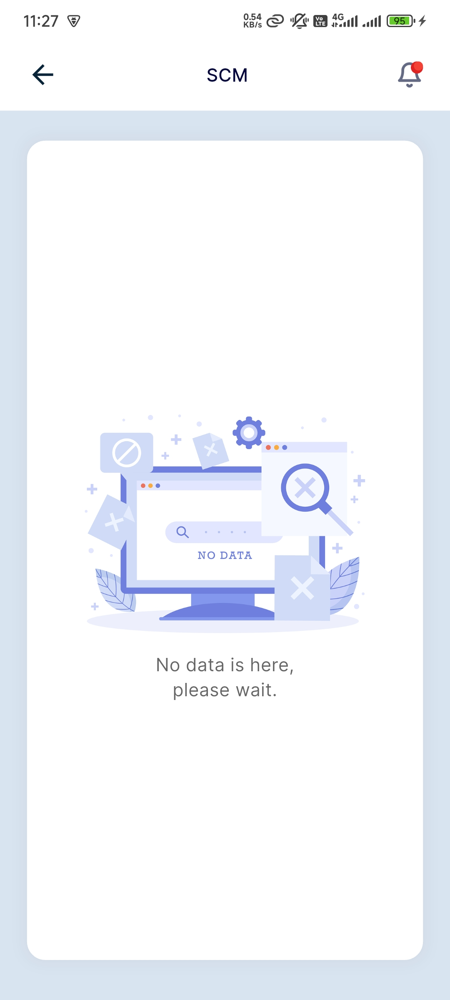

# SCube Task App

A Flutter project for SCube interview task.

## Prerequisites

- [Flutter SDK](https://flutter.dev/docs/get-started/install)
- [FVM (Flutter Version Management)](https://fvm.app/docs/getting_started/installation)

## Installation

1. **Install FVM** (if not already installed):

   ```bash
   dart pub global activate fvm
   ```

2. **Select Flutter Version**:

   ```bash
   fvm use
   ```

3. **Install Dependencies**:

   ```bash
   fvm flutter pub get
   ```

## Running the App

To run the app using FVM:

```bash
fvm flutter run
```

## Screenshots

<p float="left">
  
   
  
</p>

<p float="left">
  
  
  
  
</p>
